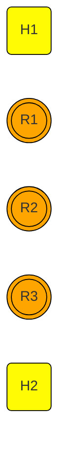

# static-routing-mininet

static-routing-mininet is a repository designed to help users learn about networking, from traditional static routing to programmable networks using the Mininet environment. The repository includes a script for setting up static routing between two routers (R1 and R2), demonstrating basic IP forwarding and routing principles.

## Requirements
To get started, you'll need to install Mininet on your WSL. Follow these steps to install Mininet:

1.  Clone the Mininet repository to your local machine :
```bash
git clone https://github.com/mininet/mininet.git
cd mininet
```

2. Run the installation script :
```bash
./util/install.sh -a
```

This will install all dependencies required for Mininet, along with Open vSwitch and other components that you'll need for network simulation.

## Static Routing
This project demonstrates static routing between hosts and routers, visualized using the following network topology:

### Static Routing Topology


