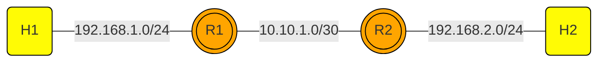

[Tugas Static Routing_225150201111009_DANI ADRIAN.pdf](https://github.com/user-attachments/files/17355935/Tugas.Static.Routing_225150201111009_DANI.ADRIAN.pdf)# static-routing-mininet
`static-routing-mininet` is a repository designed to help users learn about networking, focusing on traditional static routing and programmable networks using the Mininet environment. This repository includes scripts and configurations for setting up static routing between two routers (R1 and R2), demonstrating fundamental IP forwarding and routing principles.

## Features
- **Static Routing Setup**: Easy-to-follow scripts that establish static routing between routers.
- **Networking Basics**: Learn core networking concepts, including IP forwarding, subnetting, and routing tables.
- **Programmable Networks**: Utilize the capabilities of Mininet to simulate real-world networking scenarios in a virtual environment.

## Usage
To run the static routing simulation, execute the following command in your terminal:
```bash
sudo python3 static_routing_2rtr.py
```
This command will start the Mininet environment and set up the static routing between the two routers as defined in the script.

## Static Routing
This project demonstrates static routing between hosts and routers, visualized using the following network topology:

### Static Routing Topology



# Testing
After running the script, you can use the ping command to test connectivity between the routers and connected hosts. For example:
```bash
pingall
```

The results should be displayed as follows:
```bash
*** Ping: testing ping reachability
r1 -> r2 h1 h2
r2 -> r1 h1 h2
h1 -> r1 r2 h2
h2 -> r1 r2 h1
*** Results: 0% dropped (12/12 received)
```

# Contributing
Contributions to the static-routing-mininet repository are welcome! If you have suggestions for improvements, bug fixes, or additional features, please open an issue or submit a pull request.

# Licencse
This project is licensed under the Creative Commons Legal Code CC0 1.0 Universal. See the LICENSE file for details.

# Acknowledgements
- Mininet developers for creating an excellent platform for network simulation.
- Open vSwitch for providing robust virtual switching capabilities.

For any further questions or issues, feel free to open an issue on this repository.

Let me know if you need any more adjustments or additions!


# LAPORAN

[Tugas Static Routing_225150201111009_DANI ADRIAN.pdf](https://github.com/user-attachments/files/17355936/Tugas.Static.Routing_225150201111009_DANI.ADRIAN.pdf)
