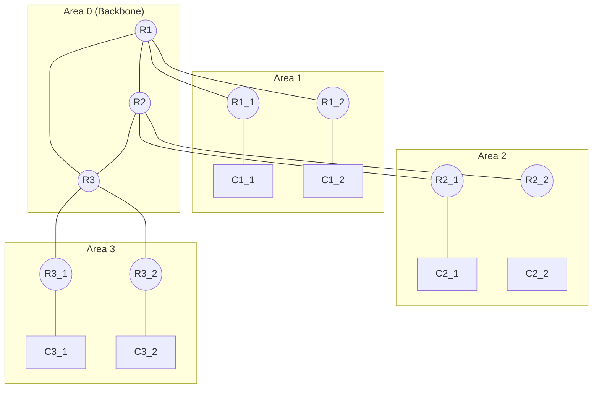

# static-routing-mininet

static-routing-mininet is a repository designed to help users learn about networking, from traditional static routing to programmable networks using the Mininet environment. The repository includes a script for setting up static routing between two routers (R1 and R2), demonstrating basic IP forwarding and routing principles.

## Requirements
To get started, you'll need to install Mininet on your WSL. Follow these steps to install Mininet:

1.  Clone the Mininet repository to your local machine :
```bash
git clone https://github.com/mininet/mininet.git
cd mininet
```

2. Run the installation script :
```bash
./util/install.sh -a
```

This will install all dependencies required for Mininet, along with Open vSwitch and other components that you'll need for network simulation.

## Static Routing
This project demonstrates static routing between hosts and routers, visualized using the following network topology:

### Static Routing Topology



## ADDITIONAL CONFIGURATION !
```bash
sudo nano /etc/sysctl.conf
net.ipv4.ip_forward=1
net.ipv6.conf.all.forwarding=1
```

example results when running the ospf-lab.py :
```bash
========================================
Warning: Linux bridge may not work with net.bridge.bridge-nf-call-arptables = 1
Warning: Linux bridge may not work with net.bridge.bridge-nf-call-iptables = 1
Warning: Linux bridge may not work with net.bridge.bridge-nf-call-ip6tables = 1
Finished initializing network in: 1.1319239139556885 seconds
```
And, config this too :
```bash
ospf-lab$ sudo modprobe bridge
sudo modprobe br_netfilter
```

The results will be like this :
```bash
bridge                335872  1 br_netfilter
stp                    12288  1 bridge
llc                    16384  2 bridge,stp
```
